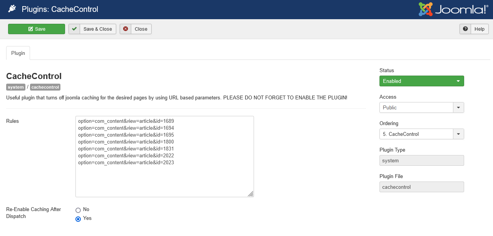

# CacheControl_J3
Useful Joomla 3.x plugin that turns off joomla caching for the desired pages by using URL based parameters.  
PLEASE DO NOT FORGET TO ENABLE THE PLUGIN!  

CacheControl is an easy to use plugin where you can define on what pages and components caching should be turned off.  
This can help if you are using extensions that have trouble with the Joomla! cache.

  
----    
  
in Joomla extension directory:  
https://extensions.joomla.org/extension/cachecontrol/  
  
Download:  
https://crosstec.org/en/downloads/free/extensions-for-joomla/details/6/25/free-extensions-for-joomla-%C2%AE-cachecontrol.html  
  
"Documentation":   
https://crosstec.org/en/forums/1-forums/72050-documentation-for-cache-control-plugin.html  
  
----  
  
  

   
    
----  
  
  
  

### "Documentation":
it is quite easy:  

- Each line defines a rule that fires disabling the joomla cache

- Each rule should contain url parameters that the plugin should listen to, if they match, the cache will be turned off as soon as a page is called to sends these url parameters.

#### For example:

option=com_content  
option=com_breezingforms

These 2 rules will disable caching entirely as soon as a page is called that sends these parameters

#### Another example:

option=com_content&id=999

This rule will stop caching for the article with the ID "999", only.

However, if you have SEF enabled, you might not see the parameters that are sent.  
In that case, disable SEF completely, load the site (or component) you want to stop caching for, write down the parameters that should trigger a rule, and finally switch back to SEF again.
